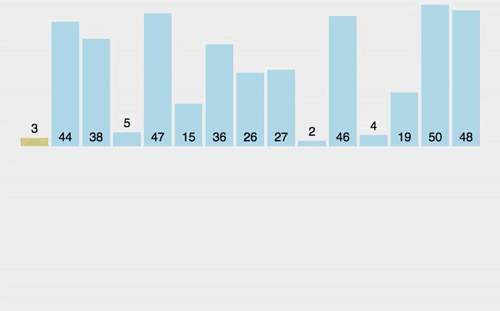
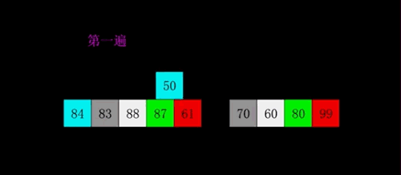

# 常用的排序算法

## 前言

查找和排序算法是算法的入门知识，其经典思想可以用于很多算法当中。因为其实现代码较短，应用较常见。所以在面试中经常会问到排序算法及其相关的问题。但万变不离其宗，只要熟悉了思想，灵活运用也不是难事。一般在面试中最常考的是快速排序和归并排序等基本的排序算法，并且经常有面试官要求现场手写出基本的排序算法。如果这些问题回答不好，估计面试官都没有继续面试下去的兴趣都没了。所以想开个好头就要把常见的排序算法思想及其特点要熟练掌握，有必要时要熟练写出代码。

今天主要介绍冒泡排序、选择排序、插入排序、希尔排序、归并排序、快速排序的思想，实现代码全部采用python实现

## 准备工作

所谓“磨刀不误砍柴工”，在进行排序算法练习的时候，我们需要做一些准备的工作：

先看看几大排序算法的复杂度：

| 中文名称 | 英文名称  | 平均时间复杂度 | 最坏时间复杂度 | 最好时间复杂度 | 空间复杂度 | 稳定性 |
| -------- | --------- | -------------- | -------------- | -------------- | ---------- | ------ |
| 选择排序 | Selection | $n^2$          | $n^2$          | $n^2$          | 1          | 不稳   |
| 冒泡排序 | Bubble    | $n^2$          | $n^2$          | n              | 1          | 稳     |
| 插入排序 | Insertion | $n^2$          | $n^2$          | n              | 1          | 稳     |
| 快速排序 | Quick     | $nlogn$        | $n^2$          | $nlogn$        | $logn$     | 不稳   |
| 归并排序 | Merge     | $nlogn$        | $nlogn$        | $nlogn$        | n          | 稳     |
| 堆排序   | heap      | $nlogn $       | $nlog n$       | $nlogn$        | 1          | 不稳   |
| 希尔排序 | Shell     | $n^{1.3}$      | $n^2$          | n              | 1          | 不稳   |
| 桶排序   | Bucket    | n+k            | $n^2$          | n              | n+k        | 稳     |
| 计数排序 | Counting  | n+k            | n+k            | n+k            | n+k        | 稳     |
| 基数排序 | Radix     | n*k            | n*k            | n*k            | n+k        | 稳     |

- 生成算法需要的数列：随机数列
- 对于一些极端情况，考虑算法的效率，需要生成基本有序的数列
- 测试算法性能的函数
- 判断数列是否有序
- 数列中元素相互交换
- 数列的拷贝

### 生成随机数列

```python
#coding=utf-8
from random import randint

def generateRandomArray(n, min, max):
    arr = []
    arr = [randint(min, max) for x in range(n)]
    return arr
```


### 生成基本有序的数列

```python
def generateNearlyOrderedArray(n, swapTimes):
    arr = []
    for i in range(n):
      	arr.append(i)
    for j in range(swapTimes):
      	posx = randint(0, n-1)
      	posy = randint(0, n-1)
      	arr[posx], arr[posy] = arr[posy], arr[posx]
    return arr
```


### 判断数列是否有序（算法是否正确）

```python
def isSorted(alist):
    for i in range(0, len(alist)-1):
      if alist[i] > alist[i+1]:
          return False
      return True
```


### 测试算法性能（耗费时间）

```python
t1 = timeit.Timer('testSort("某种排序算法函数", alist)', 'from __main__ import testSort, 某种排序算法函数, alist')
print('某种排序算法：%s s' %t1.timeit(number=1))

# func表示要检测的算法函数，alist为传入的数列
def testSort(func, alist):
  alist =  func(alist)
  assert isSorted(alist), "排序算法错误\n"
```

### 数列中元素相互交换

python语言对于交换两个数列的元素非常简单：

```python
alist[i], alist[j] = alist[j], alist[i]
```


### 数列的拷贝

对于数列的拷贝，在python语言中可以直接使用数列的切片

```python
# 直接使用切片

# list = [8,6,2,3,1,5,7,4]

alist=list[:]
```


## 冒泡排序

### 算法思想

> 冒泡排序要对一个列表多次重复遍历。它要比较相邻的两项，并且交换顺序排错的项。每对 列表实行一次遍历，就有一个最大项排在了正确的位置。大体上讲，列表的每一个数据项都会在 其相应的位置“冒泡”。如果列表有n项，第一次遍历就要比较n-1对数据。需要注意，一旦列 表中最大(按照规定的原则定义大小)的数据是所比较的数据对中的一个，它就会沿着列表一直 后移，直到这次遍历结束。

### 动图图示


### 代码实现

```python
# 冒泡排序
def bubbleSort(alist):
    n = len(alist)
    for i in range(n-1, 0, -1):
        for j in range(0, i):
            if alist[j] > alist[j+1]:
              	alist[j], alist[j+1] = alist[j+1], alist[j]
    return alist
```

### 优化点

因为冒泡排序必须要在最终位置找到之前不断交换数据项，所以它经常被认为是最低效的排 序方法。这些“浪费式”的交换操作消耗了许多时间。但是，由于冒泡排序要遍历整个未排好的 部分，它可以做一些大多数排序方法做不到的事。尤其是如果在整个排序过程中没有交换，我们 就可断定列表已经排好。因此可改良冒泡排序，使其在已知列表排好的情况下提前结束。这就是 说，如果一个列表只需要几次遍历就可排好，冒泡排序就占有优势:它可以在发现列表已排好时 立刻结束

### 优化代码

```python
# 冒泡排序
def bubbleSort(alist):
    n = len(alist)
    exchange = False
    for i in range(n-1, 0, -1):
        for j in range(0, i):
            if alist[j] > alist[j+1]:
                alist[j], alist[j+1] = alist[j+1], alist[j]
                exchange = True
      # 如果发现整个排序过程中没有交换，提前结束
        if not exchange:
          	break
    return alist
```

## 选择排序 

### 算法思想

> 选择排序提高了冒泡排序的性能，它每遍历一次列表只交换一次数据，即进行一次遍历时找 到最大的项，完成遍历后，再把它换到正确的位置。和冒泡排序一样，第一次遍历后，最大的数 据项就已归位，第二次遍历使次大项归位。这个过程持续进行，一共需要n-1次遍历来排好n个数 据，因为最后一个数据必须在第n-1次遍历之后才能归位。

### 动图演示


### 代码实现

```python
# 选择排序
def selectionSort(alist):
    n = len(alist)
      for i in range(n - 1):
        # 寻找[i,n]区间里的最小值
          min_index = i
          for j in range(i+1, n):
              if alist[j] < alist[min_index]:
                	min_index = j
          alist[i], alist[min_index] = alist[min_index], alist[i]
    return alist
```

## 插入排序 

### 算法思想

> 插入排序的算法复杂度仍然是O(n2)，但其工作原理稍有不同。它总是保持一个位置靠前的 已排好的子表，然后每一个新的数据项被“插入”到前边的子表里，排好的子表增加一项。我们认为只含有一个数据项的列表是已经排好的。每排后面一个数据(从1开始到n-1)，这 个的数据会和已排好子表中的数据比较。比较时，我们把之前已经排好的列表中比这个数据大的移到它的右边。当子表数据小于当前数据，或者当前数据已经和子表的所有数据比较了时，就可 以在此处插入当前数据项。

### 动图演示



### 代码实现

```python
# 选择排序
def selectionSort(alist):
    n = len(alist)
    for i in range(n - 1):
        # 寻找[i,n]区间里的最小值
        min_index = i
            for j in range(i+1, n):
                if alist[j] < alist[min_index]:
                    min_index = j
            alist[i], alist[min_index] = alist[min_index], alist[i]
    return alist
```

注意

这里在用python实现的时候需要注意，第一次我采用的是下面的代码：

```python
# 插入排序
def insertionSort(blist):
    n = len(blist)
    for i in range(1, n):
      	# 寻找a[i]合适的插入位置
        temp = blist[i]
        for j in range(i, 0, -1):
            if (temp < blist[j-1]):
              	blist[j] = blist[j-1]
            else:
              	break
        blist[j-1] = temp
    return blist
```

在测试性能的时候发现，当数列的逐渐变大的时候，运行时间并不是按照n * n 的速度增长，后来分析发现:

```python
 for j in range(i, 0, -1):
```

这行代码在数列很大的时候，会不听的新建列表，这回损害性能，这是非算法思想因素的影响，但是需要注意一下


## 希尔排序

### 算法思想

> 希尔排序有时又叫做“缩小间隔排序”，它以插入排序为基础，将原来要排序的列表划分为一些子列表，再对每一个子列表执行插入排序，从而实现对插入排序性能的改进。划分子列的特定方法是希尔排序的关键。我们并不是将原始列表分成含有连续元素的子列，而是确定一个划分列表的增量“i”，这个i更准确地说，是划分的间隔。然后把每间隔为i的所有元素选出来组成子列表，然后对每个子序列进行插入排序，最后当i=1时，对整体进行一次直接插入排序

### 动图演示



### 代码实现

```python
# 希尔排序
def shellSort(alist):
    n = len(alist)
    gap = n // 2
      while gap > 0:
          for i in range(gap):
            	gapInsetionSort(alist, i, gap)
          gap = gap // 2
    return alist

# # start子数列开始的起始位置， gap表示间隔

def gapInsetionSort(alist,startpos,gap):
    #希尔排序的辅助函数
    for i in range(startpos+gap,len(alist),gap):
        position=i
        currentvalue=alist[i]

        while position>startpos and alist[position-gap]>currentvalue:
            alist[position]=alist[position-gap]
            position=position-gap
        alist[position]=currentvalue
```

## 归并排序 

### 算法思想

> 归并排序是一种递归算法，它持续地将一个列表分成两半。如果列表是空的或者 只有一个元素，那么根据定义，它就被排序好了(最基本的情况)。如果列表里的元素超过一个，我们就把列表拆分，然后分别对两个部分调用递归排序。一旦这两个部分被排序好了，然后就可以对这两部分数列进行归并了。归并是这样一个过程:把两个排序好了的列表结合在一起组合成一个单一的有序的新列表。有自顶向下（递归法）和自底向上的两种实现方法。

### 动图演示


### 自顶向下（递归法）方法实现

```python
# 归并排序
def mergeSort(alist):
    n = len(alist)
    __mergeSort(alist, 0, n-1)
    return alist

# 对arr[l...r]的范围进行排序
def __mergeSort(alist, start, end):
    #当数列的大小比较小的时候，数列近乎有序的概率较大
    if (end-start <= 15):
        insertionSortHelp(alist, start, end)
        return

    if start >= end:
      	return
    # 存在风险，start+end可能越界
    mid = (start + end) // 2
    # mid = start + (end - start) // 2
    __mergeSort(alist, start, mid)
    __mergeSort(alist, mid + 1, end)
    #优化
    if alist[mid] > alist[mid+1]:
      	merge(alist, start, mid, end)

# 合并有序数列alist[start....mid] 和 alist[mid+1...end]，使之成为有序数列
def merge(alist, start, mid, end):
    # 复制一份
    blist = alist[start:end+1]
    l = start
    k = mid + 1
    pos = start

    while pos <= end:
        if (l > mid):
            alist[pos] = blist[k-start]
            k += 1
        elif (k > end):
            alist[pos] = blist[l-start]
            l += 1
        elif blist[l-start] <= blist[k-start]:
            alist[pos] = blist[l-start]
            l += 1
        else:
            alist[pos] = blist[k-start]
            k += 1
        pos += 1

def insertionSortHelp(alist,l, r):
    for i in range(l+1,r+1):
        currentvalue=alist[i]
        position=i
        while alist[position-1]>currentvalue and position>l:
            alist[position]=alist[position-1]
            position=position-1
        alist[position]=currentvalue
    return alist
```

注意 这里进行小的优化，当数列的长度小于等于15的时候，我们一般认为数列此时基本有序，这时候采用直接插入排序非常快

### 自底向上（非递归法）方法

```python
# 自底向上的归并算法
def mergeBU(alist):
    n = len(alist)
    #表示归并的大小
    size = 1
    while size <= n:
        for i in range(0, n-size, size+size):
          	merge(alist, i, i+size-1, min(i+size+size-1, n-1))
        size += size
    return alist

# 合并有序数列alist[start....mid] 和 alist[mid+1...end]，使之成为有序数列
def merge(alist, start, mid, end):
    # 复制一份
    blist = alist[start:end+1]
    l = start
    k = mid + 1
    pos = start

    while pos <= end:
        if (l > mid):
            alist[pos] = blist[k-start]
            k += 1
        elif (k > end):
            alist[pos] = blist[l-start]
            l += 1
        elif blist[l-start] <= blist[k-start]:
            alist[pos] = blist[l-start]
            l += 1
        else:
            alist[pos] = blist[k-start]
            k += 1
        pos += 1
```

## 快速排序 

### 算法思想

> 快速排序由C. A. R. Hoare在1962年提出。它的基本思想是：通过一趟排序将要排序的数据分割成独立的两部分，其中一部分的所有数据都比另外一部分的所有数据都要小，然后再按此方法对这两部分数据分别进行快速排序，整个排序过程可以递归进行，以此达到整个数据变成有序序列。

### 算法步骤

- 从数列中挑出一个元素，称为"基准"（pivot），
- 重新排序数列，所有比基准值小的元素摆放在基准前面，所有比基准值大的元素摆在基准后面（相同的数可以到任何一边）。在这个分区结束之后，该基准就处于数列的中间位置。这个称为分区（partition）操作。
- 递归地（recursively）把小于基准值元素的子数列和大于基准值元素的子数列排序。

### 动图演示


### 代码实现

```python
def __quickSort(alist, l, r):
    #当数列的大小比较小的时候，数列近乎有序的概率较大
    # if (r - l <= 15):
    #     insertionSortHelp(alist, l, r)
    #     return
    if l >= r:
      	return
    # p = partition(alist, l, r)
    p = partitionQS(alist, l, r)

    __quickSort(alist, l, p-1)
    __quickSort(alist, p+1, r)

  	# 在alist[l...r]中寻找j,使得alist[l...j] <= alist[l], alist[j+1...r] >alist[l]
def partition(alist, l, r):
		pos = randint(l, r)
    alist[pos], alist[l] = alist[l], alist[pos]
    v = alist[l]
    # v = alist[l]
    j = l
    i = l + 1
    while i <= r:
        if alist[i] <= v:
            alist[j+1],alist[i] = alist[i],alist[j+1]
            j += 1
        i += 1
    alist[l], alist[j] = alist[j], alist[l]
    return j
```

### 快速排序一些可以优化的点

- 当数列近乎有序的时，由于每次选取的都是第一个数，所以造成数列分割的极其不等，此时快排蜕化成O (n * n)的算法， 此时只要随机选取基准点即可
- 当数列中包含大量的重复元素的时候，这一版的代码也会造成"分割不等“的问题，此时需要将重复元素均匀的分散的自数列旁
- 使用三路快排